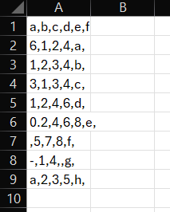
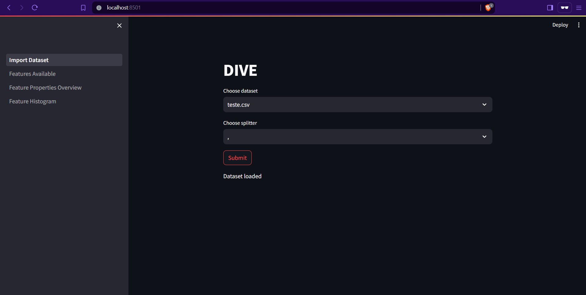
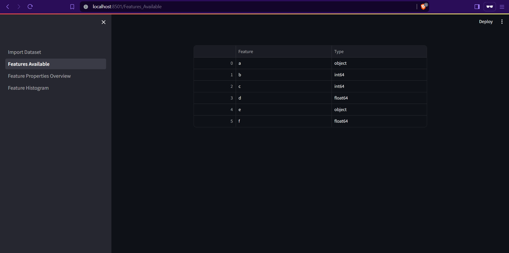
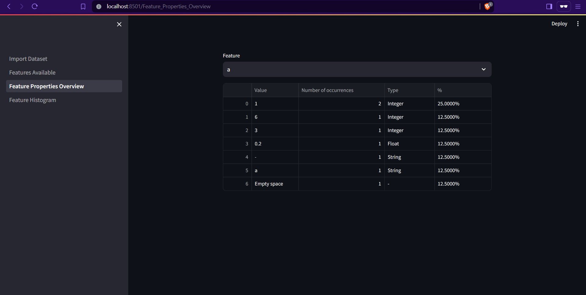
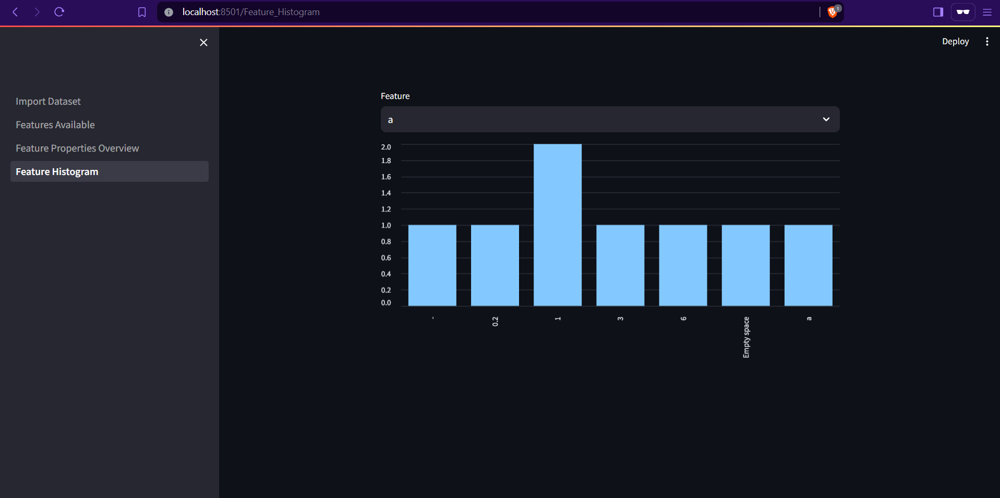

<h1>
DIVE
</h1>

**D**ata **I**nterpretation and **V**isualization **E**ngine (DIVE), is a framework designed to visualize datasets and
assist AI researchers. This tool provides the following features:

- Review available features and their types.
- Examine feature properties, including entry types, frequency counts, and overall percentages.
- Generate histograms for features, displaying the top x recurring entries (as defined in the configuration file).

<h1>Installation Requirements</h1>

The requirements for this tool are listed in the file [requirements](requirements.txt). To ensure proper behaviour, the
tool relies on the [streamlit](https://streamlit.io/) library for user interface manipulation
and [pandas](https://pandas.pydata.org/) for data manipulation. To install these requirements using pip, navigate to the
tool's root directory and execute the following command:

```commandline
pip install -r requirements.txt
```

<h1>Running the tool</h1>


There are two ways to run this application, but the recommended method is to run it locally. To run it locally and
enable network access, use the following command:

```commandline
streamlit run Import_Dataset.py
```

To run the tool on localhost only, use the following command:

```commandline
streamlit run Import_Dataset.py --browser.serverAddress localhost 
```

<h1>How to import new datasets</h1>

By default, the tool download contains only the test.csv file. To take full advantage of this application, move your
dataset to the [datasets](datasets/) folder. Currently, only CSV and JSON datasets are supported.
<h1>Changing the default configurations</h1>


The [configuration](config.ini) serves two purposes:

- max_features: Specifies the maximum number of features to load into the graph. Specifying a large number may cause
  some column labels on the x-axis to become invisible. The default value is 30.
- folder_path:
  folder_path: specifies the directory path where the datasets should be uploaded.

<h1>Gallery</h1>

<h3>Dataset selected:</h3>  


<h3>Importing dataset</h3> 


<h3>Features available</h3>  


<h3>Feature properties</h3> 


<h3>Histogram</h3>  


